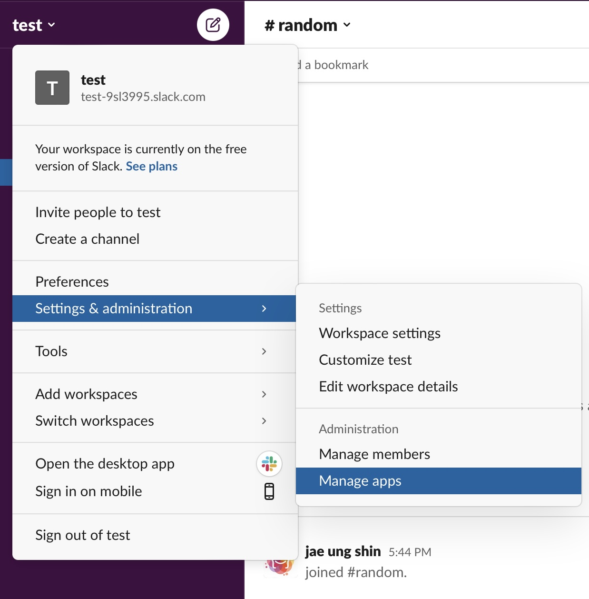
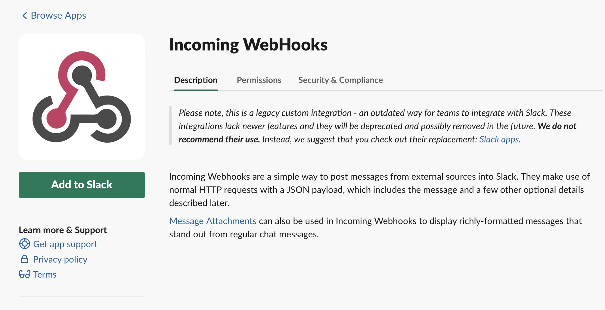
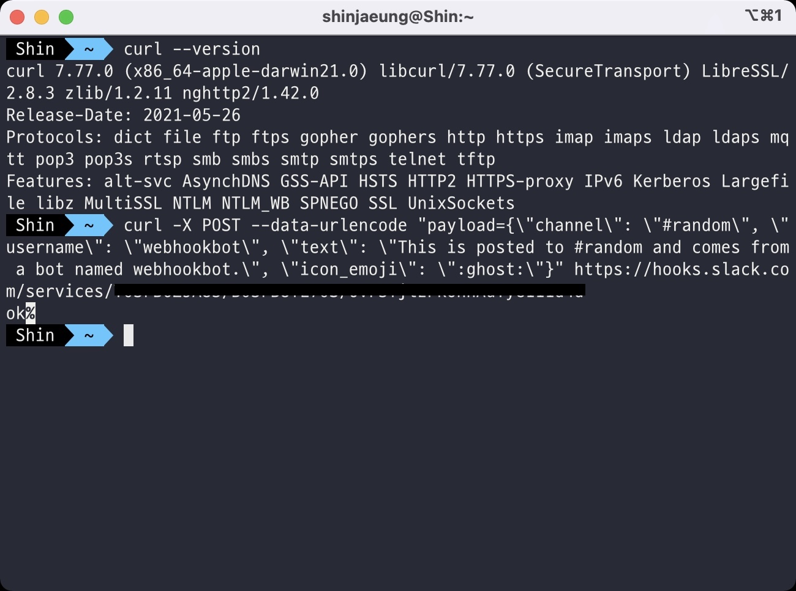
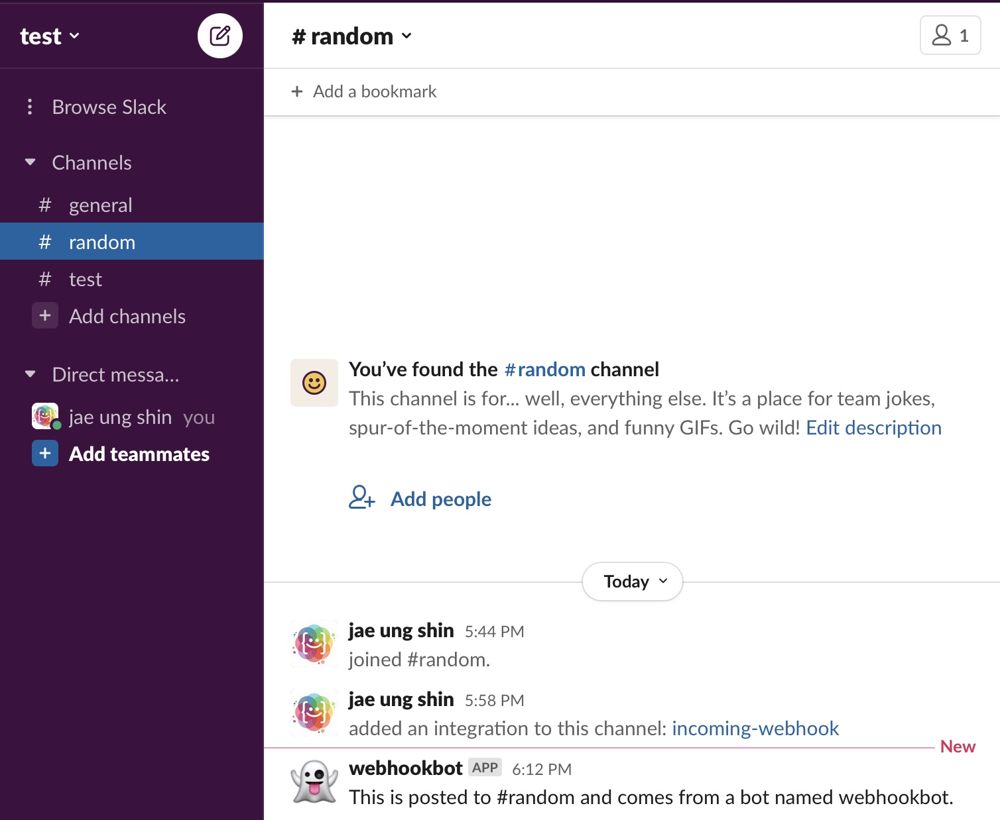
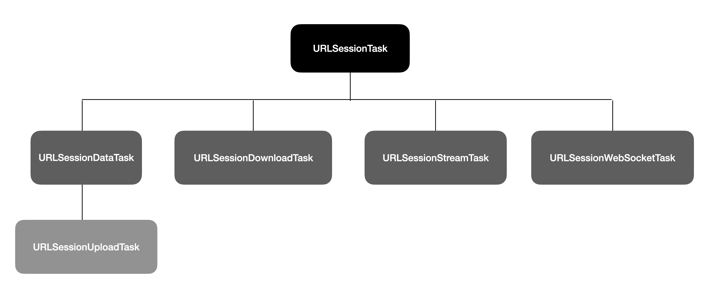

# HTTP communication with Swift

- Contents
    - [HTTP communication](#HTTP-communication)
    - [HTTP communication in iOS](#HTTP-communication-in-iOS)
    - [Practice 1](#Practice-1)
    - [Codadble](#Codable)
    - [Practice 2](#Practice-2)

<br>
<br>

## HTTP communication

- HTTP communication
    - HTTP(Hyper Text Transfer Protocol)
    - You should follow this protocol to communicate on internet

- Major HTTP method
    - GET: Get data from server
    - POST: Create data on server
    - PUT: Update data on server
    - DELETE: Delete data on server

- Slack
    - 
    - 
    - 

- CURL
    - A library to transfer data from the commandline or script
    - 
    - 

<br>
<br>

## HTTP communication in iOS

- Frameworks
    - 1. Foundation
    - 2. CFNetwork
    - 3. Core OS(Darwin)

- What we use..?
    - [x] Foundation
        - URLSession

- URLSession
    - Multithreaded iOS APIs
    - URLSessionDataTask
        - A URL session task that returns downloaded data directly to the app in memory.
    - URLSessionDownloadTask
        - A URL session task that stores downloaded data to a file.
    - URLSessionUploadTask
        - A URL session task that uploads data to the network in a request body.



```swift
// https://developer.apple.com/documentation/foundation/url_loading_system/fetching_website_data_into_memory
// Listing 1: Creating a completion handler to receive data-loading results

func startLoad() {
    let url = URL(string: "https://www.example.com/")!
    let task = URLSession.shared.dataTask(with: url) { data, response, error in
        if let error = error {
            self.handleClientError(error)
            return
        }
        guard let httpResponse = response as? HTTPURLResponse,
            (200...299).contains(httpResponse.statusCode) else {
            self.handleServerError(response)
            return
        }
        if let mimeType = httpResponse.mimeType, mimeType == "text/html",
            let data = data,
            let string = String(data: data, encoding: .utf8) {
            DispatchQueue.main.async {
                self.webView.loadHTMLString(string, baseURL: url)
            }
        }
    }
    task.resume()
}
```

<br>
<br>

## Practice 1

```swift
import Foundation

func sendHTTPRequest() {
    guard let url = URL(string: "https://hooks.slack.com/services/") else { return }
    
    var urlRequest = URLRequest(url: url)
    urlRequest.httpMethod = "POST"
    urlRequest.httpBody = #"payload={"text":"hello, world"}"#.data(using: .utf8)!
    
    URLSession.shared.dataTask(with: urlRequest).resume()
}

sendHTTPRequest()
RunLoop.current.run(until: .now + 1)
```


<br>
<br>

## Codable

- Codable
    - A type that can convert itself into and out of an external representation
    - You can make your data type encodable and decodable for **Property list**(plist) or **JSON**

```swift
// https://developer.apple.com/documentation/foundation/archives_and_serialization/encoding_and_decoding_custom_types

struct Landmark: Codable {
    var name: String
    var foundingYear: Int
    
    // Landmark now supports the Codable methods init(from:) and encode(to:), 
    // even though they aren't written as part of its declaration.
}
```

- JSON(JavaScript Object Notation)
    - A lightweight data-interchange format
    - It is easy for humans to read and write
    - It is easy for machines to parse and generate

<br>
<br>

## Practice 2

```swift
import Foundation

struct Message: Codable {
    let text: String
}

func sendHTTPRequest() {
    let message = Message(text: "hi, smile")
    guard let url = URL(string: "https://hooks.slack.com/services/") else { return }
    guard let data = try? JSONEncoder().encode(message) else { return }
    var urlRequest = URLRequest(url: url)
    urlRequest.httpMethod = "POST"
    urlRequest.setValue("application/json", forHTTPHeaderField: "Content-Type")
    urlRequest.httpBody = data
    
    URLSession.shared.dataTask(with: urlRequest).resume()
}

sendHTTPRequest()
RunLoop.current.run(until: .now + 1)
```
 


<br>
<br>


