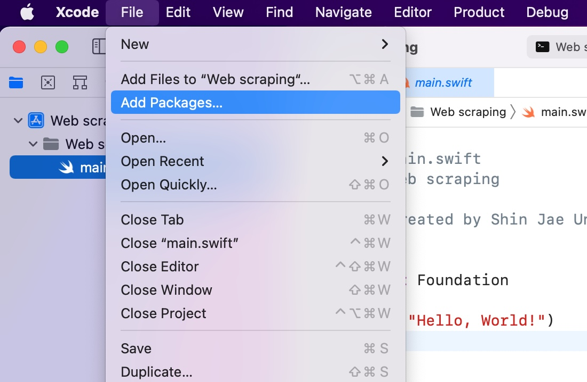
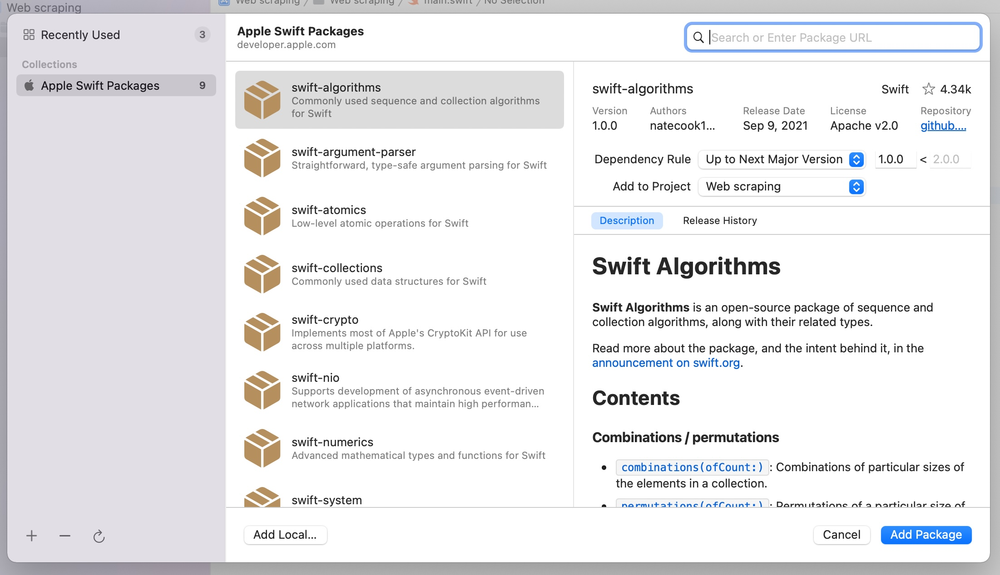
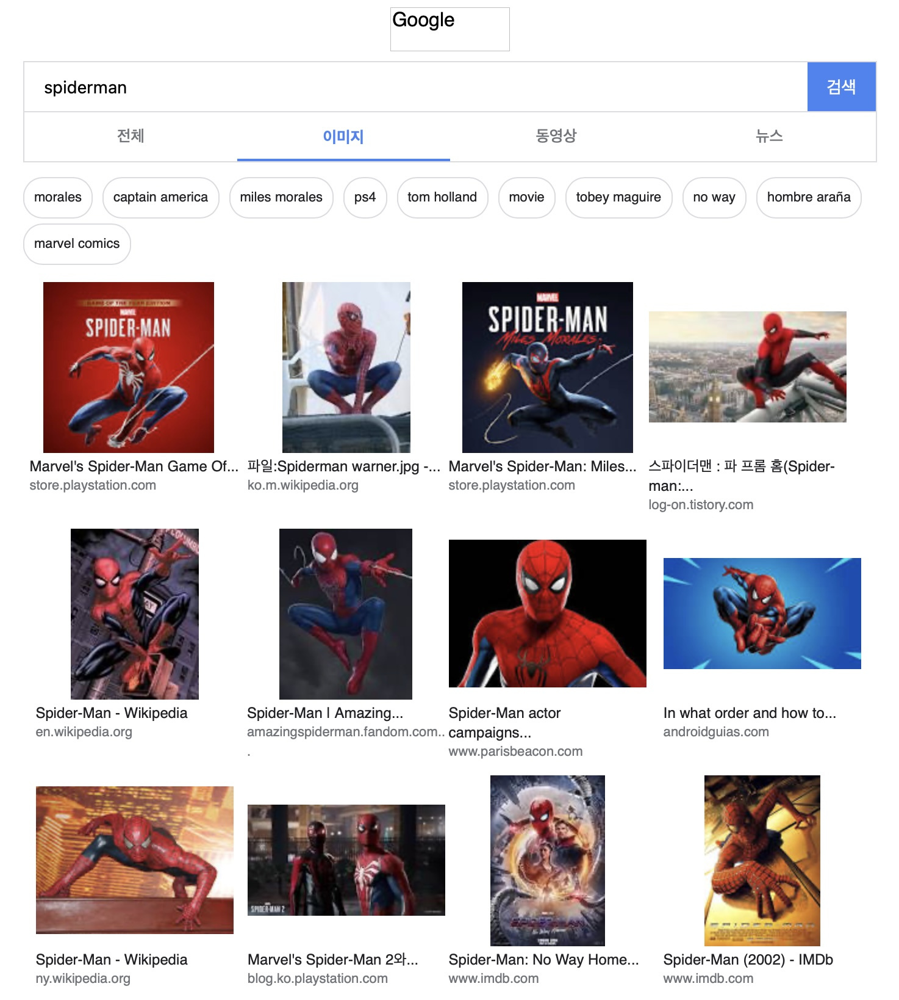
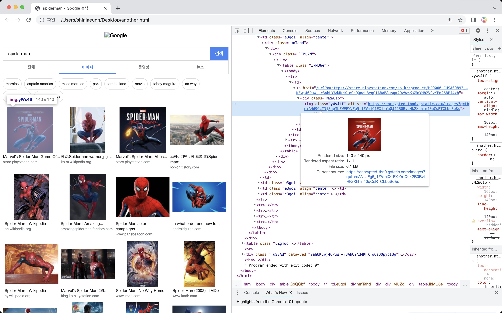
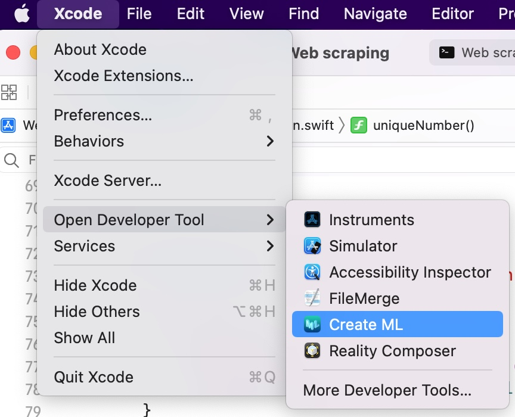
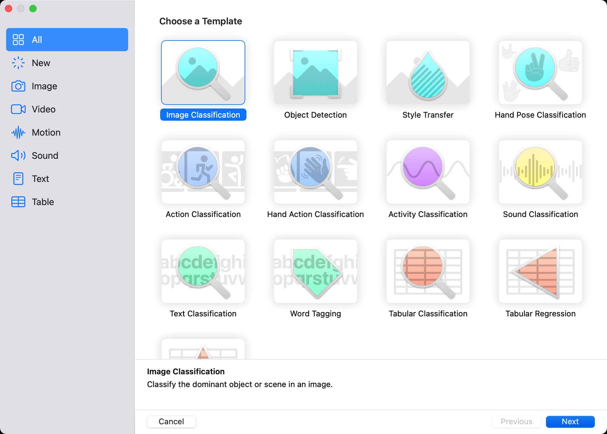
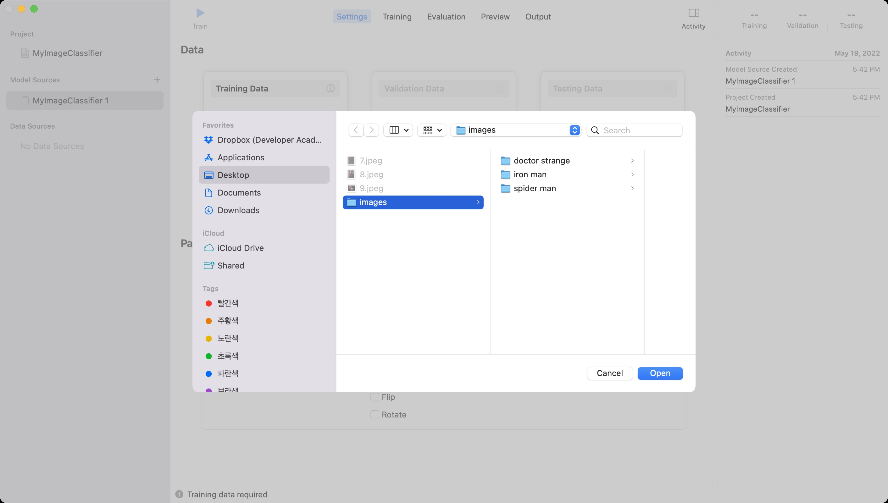
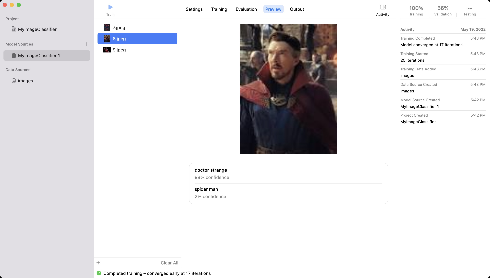

# Web scraping in Swift & CoreML

- Contents
    - [Third Party](#Third-Party)
    - [Swift Package Manager](#Swift-Package-Manager)
    - [Web Scraping](#Web-Scraping)
    - [Practice 1](#Practice-1)
    - [HTML Parsing](#HTML-Parsing)
    - [Practice 2](#Practice-2)
    - [File Manager](#File-Manager)
    - [Practice 3](#Practice-3)
    - [Closure, Capturing Values](#Closure,-Capturing-Values)
    - [Practice 4](#Practice-4)
    - [CoreML](#CoreML)
    - [Practice 5](#Practice-5)

<br>
<br>

## Third party

- Third party
    - A third person or organization less directly involved in a matter than the main people or organizations that are involved

- Dependency Management Tools in iOS
    - Swift Package Manager
    - CocoaPods
    - Carthage

- [[IOS] CocoaPods과 Carthage과 Swift Package Manager](https://dev200ok.blogspot.com/2020/03/asd.html)

<br>
<br>

## Swift Package Manager




<br>
<br>

## Web Scraping

- HTML(HyperText Markup Language)
    - Standard markup language for documents designed to be displayed in a web browser
    - [[w3schools]](https://www.w3schools.com/html/tryit.asp?filename=tryhtml_default)

- Robot.txt
    - A robots.txt file tells search engine crawlers which URLs the crawler can access on your site
    - This is used mainly to avoid overloading your site with requests  
    - [[Introduction to robots.txt]](https://developers.google.com/search/docs/advanced/robots/intro?safari_group=5)

- SwiftSoup
    - [[SwiftSoup]](https://github.com/scinfu/SwiftSoup)
    - a pure Swift library, cross-platform, for working with real-world HTML

```swift
// https://github.com/scinfu/SwiftSoup
do {
    let html: String = "<p>An <a href='http://example.com/'><b>example</b></a> link.</p>";
    let doc: Document = try SwiftSoup.parse(html)
    let link: Element = try doc.select("a").first()!
    
    let text: String = try doc.body()!.text(); // "An example link"
    let linkHref: String = try link.attr("href"); // "http://example.com/"
    let linkText: String = try link.text(); // "example""
    
    let linkOuterH: String = try link.outerHtml(); // "<a href="http://example.com"><b>example</b></a>"
    let linkInnerH: String = try link.html(); // "<b>example</b>"
} catch Exception.Error(let type, let message) {
    print(message)
} catch {
    print("error")
}
```

<br>
<br>

## Practice 1

```swift
import Foundation

enum FetchError: Error {
    case error
}

func fetchGoogleImageURLs(searchWord: String, completion: @escaping (Result<[String], Error>) -> Void) {
    let baseURL: String = "https://www.google.com/search?tbm=isch&q="
    let searchPath: String = searchWord.replacingOccurrences(of: " ", with: "%20")
    guard let url = URL(string: baseURL + searchPath) else {
        completion(.failure(FetchError.error))
        return
    }
    
    let contents: String = try! String(contentsOf: url)
    completion(.success([contents]))
}

fetchGoogleImageURLs(searchWord: "spider man") { result in
    switch result {
    case .success(let arr):
        arr.forEach { string in
            print(string)
        }
    case .failure(let error):
        print(error)
    }
}
```



<br>
<br>

## HTML Parsing



<br>
<br>

## Practice 2

```swift
import Foundation
import SwiftSoup

enum FetchError: Error {
    case error
}

func fetchGoogleImageURLs(searchWord: String, completion: @escaping (Result<[String], Error>) -> Void) {
    let baseURL: String = "https://www.google.com/search?tbm=isch&q="
    let searchPath: String = searchWord.replacingOccurrences(of: " ", with: "%20")
    guard let url = URL(string: baseURL + searchPath) else {
        completion(.failure(FetchError.error))
        return
    }
    do {
        var resultURLs: [String] = []
        
        let contents: String = try String(contentsOf: url)
        let document: Document = try SwiftSoup.parse(contents)
        
        let links = try document.getElementsByClass("yWs4tf")
        for link in links {
            let element = try link.select("img")
            let imageURL = try element.attr("src")
            resultURLs.append(imageURL)
        }
        completion(.success(resultURLs))
    } catch {
        completion(.failure(FetchError.error))
    }
}

fetchGoogleImageURLs(searchWord: "spider man") { result in
    switch result {
    case .success(let arr):
        arr.forEach { string in
            print(string)
        }
    case .failure(let error):
        print(error)
    }
}
```

<br>
<br>

## File Manager

- File System
    - iOS is Unix. You can only read and write in "sandbox"
    - For Security, Privacy, Clean up

- File Manager
    - Provides utility operations
    - FileManager is Threat safe without main thread
    - FileManager.default is in the main thread

```swift
  let url: URL = FileManager.default.URL(
      for directory: FileManager.SearchDirectory.documentDirectory,
      in domainMask: .userDomainMask // always .userDomainMask on iOS
      appropriateFor: nil, // only meaningful for "replace" file operations
      create: true
  )
```

<br>
<br>

## Practice 3

```swift
class FileSaveManager: NSObject, URLSessionDownloadDelegate {
    var urlSession: URLSession {
        URLSession(configuration: .default, delegate: self, delegateQueue: nil)
    }
    
    func downloadTask(url: URL) {
        self.urlSession.downloadTask(with: url).resume()
    }
    
    func urlSession(_ session: URLSession, downloadTask: URLSessionDownloadTask, didFinishDownloadingTo location: URL) {
        guard let desktopURL = try? FileManager.default.url(for: .desktopDirectory, in: .userDomainMask, appropriateFor: nil, create: true) else { return }
        
        let destinationURL = desktopURL.appendingPathComponent("image").appendingPathExtension("jpeg")
        try? FileManager.default.removeItem(at: destinationURL)
        try? FileManager.default.moveItem(at: location, to: destinationURL)
    }
}
```

<br>
<br>

## Closure, Capturing Values

```swift
// https://docs.swift.org/swift-book/LanguageGuide/Closures.html
func makeIncrementer(forIncrement amount: Int) -> () -> Int {
    var runningTotal = 0
    func incrementer() -> Int {
        runningTotal += amount
        return runningTotal
    }
    return incrementer
}

let incrementer = makeIncrementer(forIncrement: 1)
print(incrementer()) // 1
print(incrementer()) // 2
print(incrementer()) // 3
```

<br>
<br>

## Practice 4

```swift
class FileSaveManager: NSObject, URLSessionDownloadDelegate {
    var urlSession: URLSession {
        URLSession(configuration: .default, delegate: self, delegateQueue: nil)
    }
    let uniqueIDFactory: () -> Int
    private static func uniqueIDFactory() -> () -> Int {
        var id = 0
        func uniqueNumber() -> Int {
            id += 1
            return id
        }
        return uniqueNumber
    }

    override init() {
        self.uniqueIDFactory = FileSaveManager.uniqueIDFactory()
        super.init()
    }
    
    func downloadTask(url: URL) {
        self.urlSession.downloadTask(with: url).resume()
    }

    func urlSession(_ session: URLSession, downloadTask: URLSessionDownloadTask, didFinishDownloadingTo location: URL) {
        guard let desktopURL = try? FileManager.default.url(for: .desktopDirectory, in: .userDomainMask, appropriateFor: nil, create: true) else { return }

        let destinationURL = desktopURL.appendingPathComponent("\(uniqueIDFactory())").appendingPathExtension("jpeg")
        try? FileManager.default.removeItem(at: destinationURL)
        try? FileManager.default.moveItem(at: location, to: destinationURL)
    }
}
```

<br>
<br>

## CoreML






<br>
<br>

## Practice 5

- [Classifying Images with Vision and Core ML](https://developer.apple.com/documentation/vision/classifying_images_with_vision_and_core_ml/)


